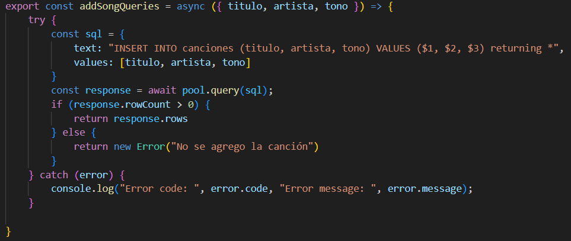
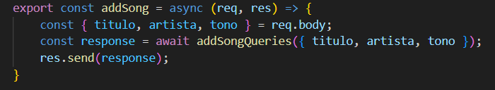
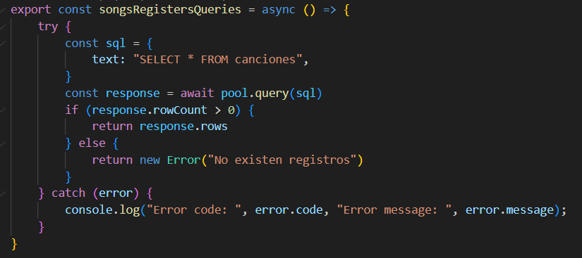
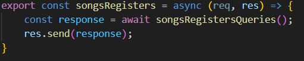
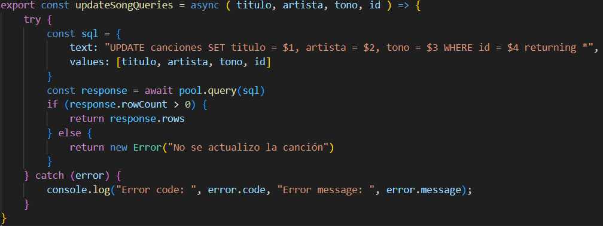
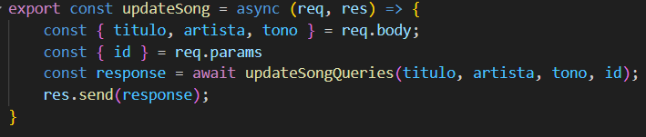
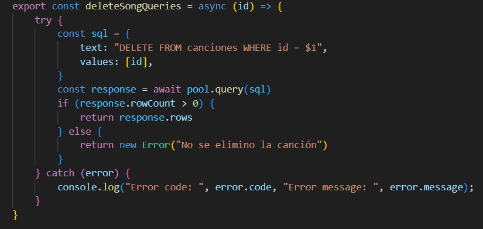
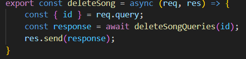

# Mi repertorio

Levantar un servidor con conexión a PostgreSQL, Insertar registros, Consultar registros, Actualizar registros y Eliminar registros a partir de un formulario. 

## Descripción del proyecto

Se crea una base de datos para la escuela de música E-sueño que es consultada mediante funciones asíncronas en base al sistema CRUD.

## Capturas de Pantalla del Proyecto

Agregar nueva canción (models/queries.js)

Agregar nueva canción (controllers/controller.js)


Registros de canciones (models/queries.js)

Registros de canciones (controllers/controller.js)


Editar registro (models/queries.js)

Editar registro (controllers/controller.js)


Eliminar registro (models/queries.js)

Eliminar registro (controllers/controller.js)


## Prerrequisitos o Dependencias

Lista de software y herramientas, incluyendo versiones, que necesitas para instalar y ejecutar este proyecto:

- Node Js
- Express
- Pg - Dotenv
- PostgreSQL

## Instalación del Proyecto

Una guía paso a paso sobre cómo configurar el entorno de desarrollo e instalar todas las dependencias.

```bash
npm init -y
```

```bash
npm i pg dotenv express
```

## Instrucciones para Ejecutar el Proyecto

Instrucciones para ejecutar el proyecto una vez instalado.

```bash
Crear un archivo .env con datos DB (DB_USER, DB_PASSWORD, DB_DATABASE, DB_HOST).
```

## Realizador del proyecto

* **Natalia García** - [GitHub](https://github.com/ngarciab22)

## Licencia

Este proyecto está bajo la Licencia MIT - ve el archivo [license](license) para detalles